For this project, you will analyze data on GDP and life expectancy from the World Health Organization and the World Bank to try and identify the relationship between the GDP and life expectancy of six countries.

During this project, you will analyze, prepare, and plot data in order to answer questions in a meaningful way.

After you perform your analysis, you’ll be creating a blog post to share your findings on the World Health Organization website.


```python
#import necessary libraries
import pandas as pd
import matplotlib.pyplot as plt
import seaborn as sns
```


```python
lf_ex_df = pd.read_csv('/Users/benjaminmcdaniel/Desktop/Life-Expectancy-and-GDP-Starter/all_data.csv')

```


```python
#set options for pandas print function for better readability and exploration
pd.set_option('display.max_rows', None)
pd.set_option('display.max_columns', None)
pd.set_option('display.width', None)
pd.set_option('display.max_colwidth', None)

#assign value to SEED for use in random generator repeatability
SEED = 1

print(lf_ex_df)
```

                         Country  Year  Life expectancy at birth (years)  \
    0                      Chile  2000                              77.3   
    1                      Chile  2001                              77.3   
    2                      Chile  2002                              77.8   
    3                      Chile  2003                              77.9   
    4                      Chile  2004                              78.0   
    5                      Chile  2005                              78.4   
    6                      Chile  2006                              78.9   
    7                      Chile  2007                              78.9   
    8                      Chile  2008                              79.6   
    9                      Chile  2009                              79.3   
    10                     Chile  2010                              79.1   
    11                     Chile  2011                              79.8   
    12                     Chile  2012                              79.9   
    13                     Chile  2013                              80.1   
    14                     Chile  2014                              80.3   
    15                     Chile  2015                              80.5   
    16                     China  2000                              71.7   
    17                     China  2001                              72.2   
    18                     China  2002                              72.7   
    19                     China  2003                              73.1   
    20                     China  2004                              73.5   
    21                     China  2005                              73.9   
    22                     China  2006                              74.2   
    23                     China  2007                              74.4   
    24                     China  2008                              74.5   
    25                     China  2009                              74.9   
    26                     China  2010                              75.0   
    27                     China  2011                              75.2   
    28                     China  2012                              75.4   
    29                     China  2013                              75.6   
    30                     China  2014                              75.8   
    31                     China  2015                              76.1   
    32                   Germany  2000                              78.0   
    33                   Germany  2001                              78.3   
    34                   Germany  2002                              78.4   
    35                   Germany  2003                              78.5   
    36                   Germany  2004                              79.1   
    37                   Germany  2005                              79.2   
    38                   Germany  2006                              79.6   
    39                   Germany  2007                              79.8   
    40                   Germany  2008                              79.9   
    41                   Germany  2009                              80.0   
    42                   Germany  2010                              80.1   
    43                   Germany  2011                              80.5   
    44                   Germany  2012                              80.6   
    45                   Germany  2013                              80.6   
    46                   Germany  2014                              80.9   
    47                   Germany  2015                              81.0   
    48                    Mexico  2000                              74.8   
    49                    Mexico  2001                              75.0   
    50                    Mexico  2002                              75.0   
    51                    Mexico  2003                              75.0   
    52                    Mexico  2004                              75.4   
    53                    Mexico  2005                              75.3   
    54                    Mexico  2006                              75.8   
    55                    Mexico  2007                              76.0   
    56                    Mexico  2008                              75.6   
    57                    Mexico  2009                              75.7   
    58                    Mexico  2010                              75.6   
    59                    Mexico  2011                              76.1   
    60                    Mexico  2012                              76.3   
    61                    Mexico  2013                              76.6   
    62                    Mexico  2014                              76.6   
    63                    Mexico  2015                              76.7   
    64  United States of America  2000                              76.8   
    65  United States of America  2001                              76.9   
    66  United States of America  2002                              77.0   
    67  United States of America  2003                              77.2   
    68  United States of America  2004                              77.5   
    69  United States of America  2005                              77.5   
    70  United States of America  2006                              77.8   
    71  United States of America  2007                              78.1   
    72  United States of America  2008                              78.2   
    73  United States of America  2009                              78.5   
    74  United States of America  2010                              78.7   
    75  United States of America  2011                              78.7   
    76  United States of America  2012                              78.8   
    77  United States of America  2013                              78.9   
    78  United States of America  2014                              79.1   
    79  United States of America  2015                              79.3   
    80                  Zimbabwe  2000                              46.0   
    81                  Zimbabwe  2001                              45.3   
    82                  Zimbabwe  2002                              44.8   
    83                  Zimbabwe  2003                              44.5   
    84                  Zimbabwe  2004                              44.3   
    85                  Zimbabwe  2005                              44.6   
    86                  Zimbabwe  2006                              45.4   
    87                  Zimbabwe  2007                              46.6   
    88                  Zimbabwe  2008                              48.2   
    89                  Zimbabwe  2009                              50.0   
    90                  Zimbabwe  2010                              52.4   
    91                  Zimbabwe  2011                              54.9   
    92                  Zimbabwe  2012                              56.6   
    93                  Zimbabwe  2013                              58.0   
    94                  Zimbabwe  2014                              59.2   
    95                  Zimbabwe  2015                              60.7   
    
                 GDP  
    0   7.786093e+10  
    1   7.097992e+10  
    2   6.973681e+10  
    3   7.564346e+10  
    4   9.921039e+10  
    5   1.229650e+11  
    6   1.547880e+11  
    7   1.736060e+11  
    8   1.796380e+11  
    9   1.723890e+11  
    10  2.185380e+11  
    11  2.522520e+11  
    12  2.671220e+11  
    13  2.783840e+11  
    14  2.609900e+11  
    15  2.425180e+11  
    16  1.211350e+12  
    17  1.339400e+12  
    18  1.470550e+12  
    19  1.660290e+12  
    20  1.955350e+12  
    21  2.285970e+12  
    22  2.752130e+12  
    23  3.552180e+12  
    24  4.598210e+12  
    25  5.109950e+12  
    26  6.100620e+12  
    27  7.572550e+12  
    28  8.560550e+12  
    29  9.607220e+12  
    30  1.048240e+13  
    31  1.106470e+13  
    32  1.949950e+12  
    33  1.950650e+12  
    34  2.079140e+12  
    35  2.505730e+12  
    36  2.819250e+12  
    37  2.861410e+12  
    38  3.002450e+12  
    39  3.439950e+12  
    40  3.752370e+12  
    41  3.418010e+12  
    42  3.417090e+12  
    43  3.757700e+12  
    44  3.543980e+12  
    45  3.752510e+12  
    46  3.890610e+12  
    47  3.375610e+12  
    48  6.836480e+11  
    49  7.247040e+11  
    50  7.415600e+11  
    51  7.132840e+11  
    52  7.702680e+11  
    53  8.663460e+11  
    54  9.652810e+11  
    55  1.043470e+12  
    56  1.101280e+12  
    57  8.949490e+11  
    58  1.051130e+12  
    59  1.171190e+12  
    60  1.186600e+12  
    61  1.261980e+12  
    62  1.298460e+12  
    63  1.152260e+12  
    64  1.030000e+13  
    65  1.060000e+13  
    66  1.100000e+13  
    67  1.150000e+13  
    68  1.230000e+13  
    69  1.310000e+13  
    70  1.390000e+13  
    71  1.450000e+13  
    72  1.470000e+13  
    73  1.440000e+13  
    74  1.500000e+13  
    75  1.550000e+13  
    76  1.620000e+13  
    77  1.670000e+13  
    78  1.740000e+13  
    79  1.810000e+13  
    80  6.689958e+09  
    81  6.777385e+09  
    82  6.342116e+09  
    83  5.727592e+09  
    84  5.805598e+09  
    85  5.755215e+09  
    86  5.443896e+09  
    87  5.291950e+09  
    88  4.415703e+09  
    89  8.621574e+09  
    90  1.014186e+10  
    91  1.209845e+10  
    92  1.424249e+10  
    93  1.545177e+10  
    94  1.589105e+10  
    95  1.630467e+10  


```python
#rename variables that do not conform to pythonic naming conventions
lf_ex_df.rename(columns = {'Country':'country','Year':'year','Life expectancy at birth (years)':'life_ex_yrs','GDP':'gdp'},\
          inplace = True)
print(lf_ex_df.columns)
```

    Index(['country', 'year', 'life_ex_yrs', 'gdp'], dtype='object')


```python
#determine types of data included in the set
lf_ex_df.dtypes

```


    country         object
    year             int64
    life_ex_yrs    float64
    gdp            float64
    dtype: object


```python
#Inspect the shape of the data frame and 
print(lf_ex_df.shape)
lf_ex_df.describe()
```

    (96, 4)


<div>
<style scoped>
    .dataframe tbody tr th:only-of-type {
        vertical-align: middle;
    }

    .dataframe tbody tr th {
        vertical-align: top;
    }

    .dataframe thead th {
        text-align: right;
    }
</style>
<table border="1" class="dataframe">
  <thead>
    <tr style="text-align: right;">
      <th></th>
      <th>year</th>
      <th>life_ex_yrs</th>
      <th>gdp</th>
    </tr>
  </thead>
  <tbody>
    <tr>
      <th>count</th>
      <td>96.000000</td>
      <td>96.000000</td>
      <td>9.600000e+01</td>
    </tr>
    <tr>
      <th>mean</th>
      <td>2007.500000</td>
      <td>72.789583</td>
      <td>3.880499e+12</td>
    </tr>
    <tr>
      <th>std</th>
      <td>4.633971</td>
      <td>10.672882</td>
      <td>5.197561e+12</td>
    </tr>
    <tr>
      <th>min</th>
      <td>2000.000000</td>
      <td>44.300000</td>
      <td>4.415703e+09</td>
    </tr>
    <tr>
      <th>25%</th>
      <td>2003.750000</td>
      <td>74.475000</td>
      <td>1.733018e+11</td>
    </tr>
    <tr>
      <th>50%</th>
      <td>2007.500000</td>
      <td>76.750000</td>
      <td>1.280220e+12</td>
    </tr>
    <tr>
      <th>75%</th>
      <td>2011.250000</td>
      <td>78.900000</td>
      <td>4.067510e+12</td>
    </tr>
    <tr>
      <th>max</th>
      <td>2015.000000</td>
      <td>81.000000</td>
      <td>1.810000e+13</td>
    </tr>
  </tbody>
</table>
</div>


```python

```


```python
#begin univariate visualizations for numeric variables
sns.set_palette('bright')
sns.set_style("darkgrid")
sns.displot(lf_ex_df.life_ex_yrs, bins = 16, kde=False)
plt.title('Distribution of Life Expectancy in Years')
plt.xlabel('Life Expectancy at Birth in Years')
plt.ylabel('Count')
plt.show()
plt.clf()
```


    
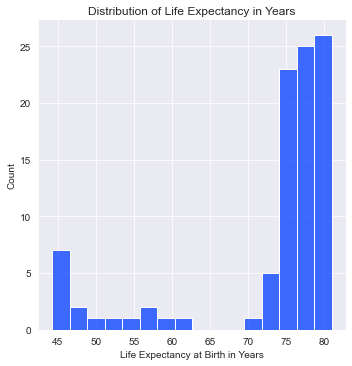
    


    <Figure size 432x288 with 0 Axes>


```python
sns.set_palette('bright')
sns.set_style("darkgrid")
sns.displot(lf_ex_df.year, bins = 16, kde=False)
plt.title('Distribution of Years')
plt.xlabel('Years')
plt.ylabel('Year Count in Data')
plt.show()
plt.clf()
```


    
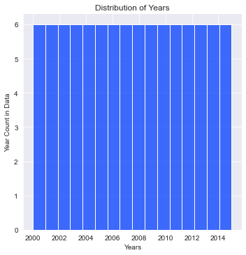
    


    <Figure size 432x288 with 0 Axes>


```python
sns.set_palette('bright')
sns.set_style("darkgrid")
sns.displot(lf_ex_df.gdp, bins = 20, kde=False)
plt.title('Count at GPD Range')
plt.xlabel('GDP in Trillions of USD')
plt.ylabel('Count at GPD Range')
plt.title('Distribution of GDP')
plt.show()
plt.clf()
```


    
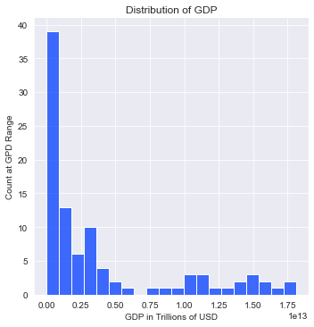
    


    <Figure size 432x288 with 0 Axes>


```python
sns.boxplot(x = 'country', y= 'life_ex_yrs', data = lf_ex_df)
plt.xticks(rotation = 90)
plt.title('Life Expectancy at Birth by Country')
plt.xlabel('Country')
plt.ylabel('Life Expectancy at Birth in Years')
plt.show()
plt.clf()

```


    
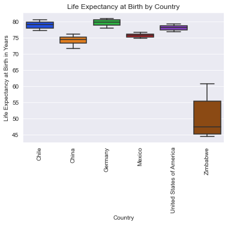
    


    <Figure size 432x288 with 0 Axes>


```python
sns.boxplot(x = 'country', y= 'gdp', data = lf_ex_df)
plt.xticks(rotation = 90)
plt.title('GDP by Country')
plt.xlabel('Country')
plt.ylabel('GDP in Trillions of USD')
plt.show()
plt.clf()
```


    
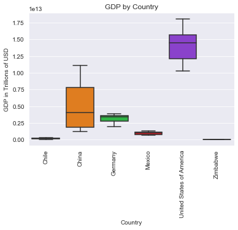
    


    <Figure size 432x288 with 0 Axes>


```python
sns.pairplot(lf_ex_df)
plt.show()
plt.clf()
```


    
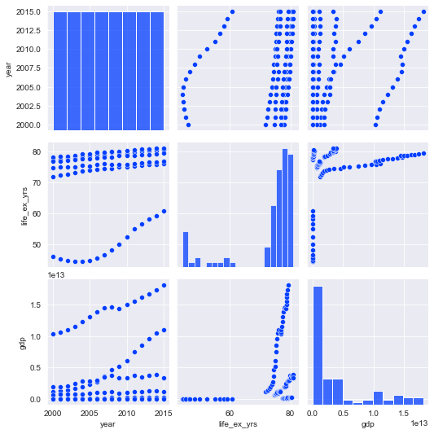
    


    <Figure size 432x288 with 0 Axes>


```python
#check prepared data set for multicollinearity using a correlation matrix
corr = lf_ex_df.corr()
print(corr)
```

                     year  life_ex_yrs       gdp
    year         1.000000     0.155050  0.208288
    life_ex_yrs  0.155050     1.000000  0.343207
    gdp          0.208288     0.343207  1.000000


```python
plt.figure(figsize=(40,20))
sns.heatmap(corr, xticklabels = corr.columns, yticklabels = corr.columns,vmin = -1, center = 0, vmax = 1, cmap='PuOr', annot=True, fmt='.1g', square = True)
plt.show()
plt.clf()
```


    
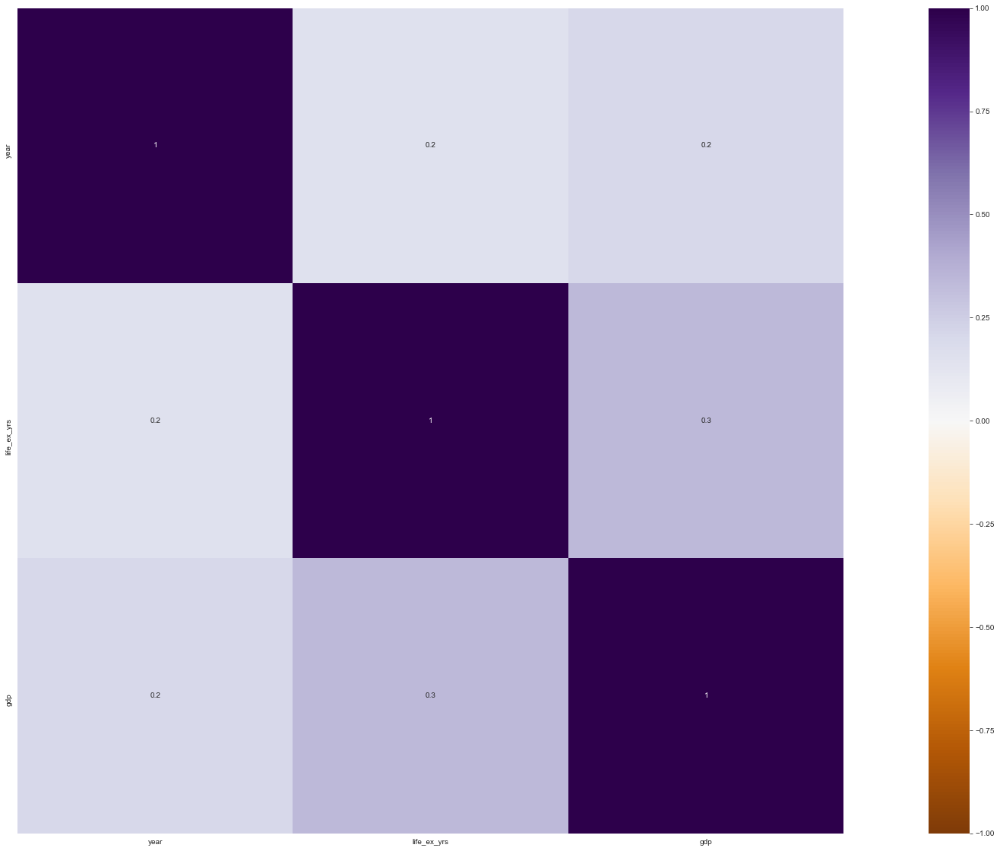
    


    <Figure size 432x288 with 0 Axes>


```python
sns.set_palette('bright')
sns.set_style("darkgrid")
sns.scatterplot(data = lf_ex_df, x='gdp', y='life_ex_yrs', hue='country')
plt.title('GDP vs Life Expectancy at Birth')
plt.xlabel('GDP in Trillions of USD')
plt.ylabel('Life Expectancy in Years at Birth')
plt.show()
plt.clf()
```


    
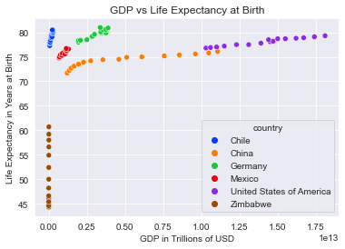
    


    <Figure size 432x288 with 0 Axes>


```python
#seperate the data by country for further processing
chile = lf_ex_df[lf_ex_df['country']== 'Chile']
china = lf_ex_df[lf_ex_df['country']== 'China']
germany = lf_ex_df[lf_ex_df['country']== 'Germany']
mexico = lf_ex_df[lf_ex_df['country']== 'Mexico']
usa = lf_ex_df[lf_ex_df['country']== 'United States of America']
zimbabwe = lf_ex_df[lf_ex_df['country']== 'Zimbabwe']
```


```python
#chile
sns.set_palette('bright')
sns.set_style("darkgrid")
sns.lmplot(data = chile, x='gdp', y='life_ex_yrs')
plt.title('GDP vs Life Expectancy at Birth in Chile')
plt.xlabel('GDP in Trillions of USD')
plt.ylabel('Life Expectancy in Years at Birth')
plt.show()
plt.clf()
#china
sns.set_palette('bright')
sns.set_style("darkgrid")
sns.lmplot(data = china, x='gdp', y='life_ex_yrs')
plt.title('GDP vs Life Expectancy at Birth in China')
plt.xlabel('GDP in Trillions of USD')
plt.ylabel('Life Expectancy in Years at Birth')
plt.show()
plt.clf()
#Germany
sns.set_palette('bright')
sns.set_style("darkgrid")
sns.lmplot(data = germany, x='gdp', y='life_ex_yrs')
plt.title('GDP vs Life Expectancy at Birth in Germany')
plt.xlabel('GDP in Trillions of USD')
plt.ylabel('Life Expectancy in Years at Birth')
plt.show()
plt.clf()
#Mexico
sns.set_palette('bright')
sns.set_style("darkgrid")
sns.lmplot(data = mexico, x='gdp', y='life_ex_yrs')
plt.title('GDP vs Life Expectancy at Birth in Mexico')
plt.xlabel('GDP in Trillions of USD')
plt.ylabel('Life Expectancy in Years at Birth')
plt.show()
plt.clf()
#United States of America
sns.set_palette('bright')
sns.set_style("darkgrid")
sns.lmplot(data = usa, x='gdp', y='life_ex_yrs')
plt.title('GDP vs Life Expectancy at Birth in USA')
plt.xlabel('GDP in Trillions of USD')
plt.ylabel('Life Expectancy in Years at Birth')
plt.show()
plt.clf()
#Zimbabwe
sns.set_palette('bright')
sns.set_style("darkgrid")
sns.lmplot(data = zimbabwe, x='gdp', y='life_ex_yrs')
plt.title('GDP vs Life Expectancy at Birth in Zimbabwe')
plt.xlabel('GDP in Trillions of USD')
plt.ylabel('Life Expectancy in Years at Birth')
plt.show()
plt.clf()
```


    
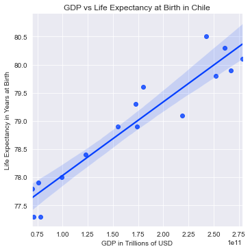
    


    <Figure size 432x288 with 0 Axes>


    
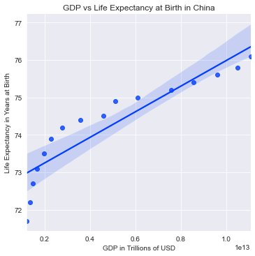
    


    <Figure size 432x288 with 0 Axes>


    
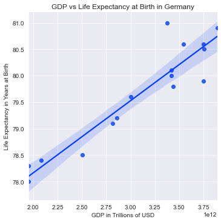
    


    <Figure size 432x288 with 0 Axes>


    
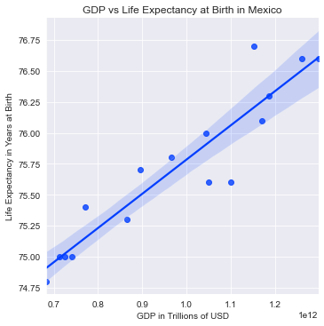
    


    <Figure size 432x288 with 0 Axes>


    
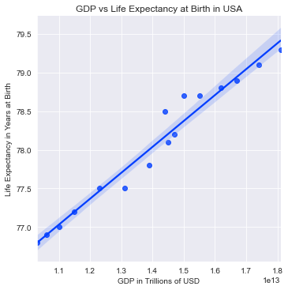
    


    <Figure size 432x288 with 0 Axes>


    
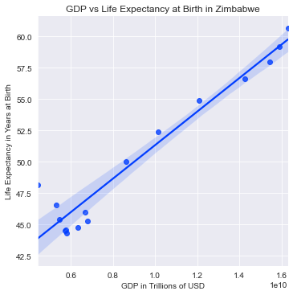
    


    <Figure size 432x288 with 0 Axes>


```python
#develop a linear model to predict life expectancy based on year of birth, country, and GDP
import statsmodels.api as sm
lx_model1 = sm.OLS.from_formula('life_ex_yrs ~ gdp + country + year', data = lf_ex_df).fit()
lx_model1.summary()
```


<table class="simpletable">
<caption>OLS Regression Results</caption>
<tr>
  <th>Dep. Variable:</th>       <td>life_ex_yrs</td>   <th>  R-squared:         </th> <td>   0.952</td>
</tr>
<tr>
  <th>Model:</th>                   <td>OLS</td>       <th>  Adj. R-squared:    </th> <td>   0.949</td>
</tr>
<tr>
  <th>Method:</th>             <td>Least Squares</td>  <th>  F-statistic:       </th> <td>   292.8</td>
</tr>
<tr>
  <th>Date:</th>             <td>Fri, 29 Oct 2021</td> <th>  Prob (F-statistic):</th> <td>2.43e-56</td>
</tr>
<tr>
  <th>Time:</th>                 <td>14:32:26</td>     <th>  Log-Likelihood:    </th> <td> -217.48</td>
</tr>
<tr>
  <th>No. Observations:</th>      <td>    96</td>      <th>  AIC:               </th> <td>   449.0</td>
</tr>
<tr>
  <th>Df Residuals:</th>          <td>    89</td>      <th>  BIC:               </th> <td>   466.9</td>
</tr>
<tr>
  <th>Df Model:</th>              <td>     6</td>      <th>                     </th>     <td> </td>   
</tr>
<tr>
  <th>Covariance Type:</th>      <td>nonrobust</td>    <th>                     </th>     <td> </td>   
</tr>
</table>
<table class="simpletable">
<tr>
                   <td></td>                      <th>coef</th>     <th>std err</th>      <th>t</th>      <th>P>|t|</th>  <th>[0.025</th>    <th>0.975]</th>  
</tr>
<tr>
  <th>Intercept</th>                           <td>   -0.0860</td> <td>    0.031</td> <td>   -2.779</td> <td> 0.007</td> <td>   -0.147</td> <td>   -0.025</td>
</tr>
<tr>
  <th>country[T.China]</th>                    <td>   -6.1746</td> <td>    1.100</td> <td>   -5.614</td> <td> 0.000</td> <td>   -8.360</td> <td>   -3.989</td>
</tr>
<tr>
  <th>country[T.Germany]</th>                  <td>   -0.2053</td> <td>    0.954</td> <td>   -0.215</td> <td> 0.830</td> <td>   -2.101</td> <td>    1.690</td>
</tr>
<tr>
  <th>country[T.Mexico]</th>                   <td>   -3.4877</td> <td>    0.864</td> <td>   -4.039</td> <td> 0.000</td> <td>   -5.204</td> <td>   -1.772</td>
</tr>
<tr>
  <th>country[T.United States of America]</th> <td>   -5.1864</td> <td>    2.184</td> <td>   -2.375</td> <td> 0.020</td> <td>   -9.526</td> <td>   -0.846</td>
</tr>
<tr>
  <th>country[T.Zimbabwe]</th>                 <td>  -28.8163</td> <td>    0.856</td> <td>  -33.646</td> <td> 0.000</td> <td>  -30.518</td> <td>  -27.115</td>
</tr>
<tr>
  <th>gdp</th>                                 <td> 3.093e-13</td> <td> 1.45e-13</td> <td>    2.136</td> <td> 0.035</td> <td> 2.16e-14</td> <td> 5.97e-13</td>
</tr>
<tr>
  <th>year</th>                                <td>    0.0394</td> <td>    0.000</td> <td>  128.022</td> <td> 0.000</td> <td>    0.039</td> <td>    0.040</td>
</tr>
</table>
<table class="simpletable">
<tr>
  <th>Omnibus:</th>       <td>44.970</td> <th>  Durbin-Watson:     </th> <td>   0.102</td>
</tr>
<tr>
  <th>Prob(Omnibus):</th> <td> 0.000</td> <th>  Jarque-Bera (JB):  </th> <td> 214.517</td>
</tr>
<tr>
  <th>Skew:</th>          <td> 1.389</td> <th>  Prob(JB):          </th> <td>2.62e-47</td>
</tr>
<tr>
  <th>Kurtosis:</th>      <td> 9.775</td> <th>  Cond. No.          </th> <td>3.63e+15</td>
</tr>
</table><br/><br/>Notes:<br/>[1] Standard Errors assume that the covariance matrix of the errors is correctly specified.<br/>[2] The condition number is large, 3.63e+15. This might indicate that there are<br/>strong multicollinearity or other numerical problems.


```python
#inspect the residuals and fitted values of each model on the data set
fitted_values1 = lx_model1.predict(lf_ex_df)
print(fitted_values1.head())
residuals1 = lf_ex_df.life_ex_yrs - fitted_values1

print(residuals1.head())

```

    0    78.638117
    1    78.675339
    2    78.714305
    3    78.755481
    4    78.802120
    dtype: float64
    0   -1.338117
    1   -1.375339
    2   -0.914305
    3   -0.855481
    4   -0.802120
    dtype: float64


```python
#inspect the distribution of the residuals model1
sns.set_palette('bright')
sns.set_style("darkgrid")
sns.kdeplot(residuals1, shade=True)
plt.title('Residuals Model 1')
plt.show()
plt.clf()
```


    
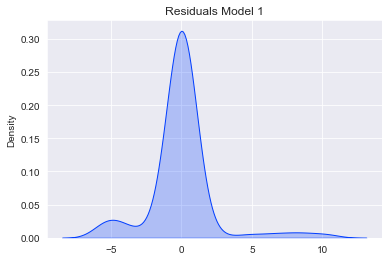
    


    <Figure size 432x288 with 0 Axes>


```python
#inspect model1 residuals for homoscedasticity there is a patern present homoscedasticity not present.
sns.set_palette('bright')
plt.scatter(fitted_values1, residuals1)
plt.title('model1 residual values vs fitted values')
plt.show()
plt.clf()
```


    
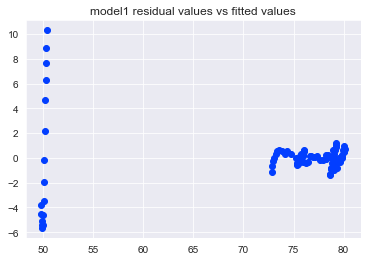
    


    <Figure size 432x288 with 0 Axes>


```python

```
